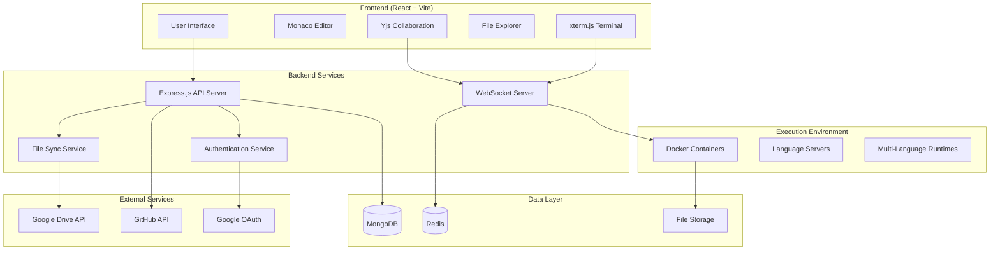

# Design Document

## Overview

The browser-based IDE will be built as a modern web application with a React frontend and Node.js backend, utilizing containerized execution environments for secure multi-language code execution. The architecture follows a microservices approach with clear separation between the presentation layer, API layer, and execution environment.

## Architecture

### High-Level Architecture



### Technology Stack

**Frontend:**
- React 18 with Vite for fast development and building
- Monaco Editor for code editing with syntax highlighting
- xterm.js for terminal emulation
- Yjs for real-time collaboration (CRDT)
- TailwindCSS + shadcn/ui for styling and components
- Zustand for state management
- Socket.IO client for WebSocket communication

**Backend:**
- Node.js with Express.js framework
- Socket.IO for WebSocket server
- JWT for authentication
- Passport.js for OAuth integration
- Docker SDK for container management
- MongoDB with Mongoose for data persistence
- Redis for session storage and real-time data

**Execution Environment:**
- Docker containers with multi-language support
- Language Server Protocol (LSP) servers
- Ubuntu-based base images with preinstalled runtimes

## Components and Interfaces

### Frontend Components

#### 1. IDE Layout Component
```javascript
// Main layout with resizable panels
const IDELayout = {
  sidebar: FileExplorer,
  mainPanel: {
    editorTabs: MonacoTabs,
    terminal: XTermTerminal
  },
  statusBar: StatusBar,
  collaborationPanel: PresenceIndicators
}
```

#### 2. Monaco Editor Integration
```javascript
// Monaco editor configuration
const monacoConfig = {
  language: 'javascript', // Dynamic based on file type
  theme: 'vs-dark',
  automaticLayout: true,
  minimap: { enabled: true },
  scrollBeyondLastLine: false,
  fontSize: 14,
  wordWrap: 'on'
}

// LSP integration for IntelliSense
const lspClient = {
  connect: (language) => WebSocket connection to LSP server,
  onHover: (position) => Request hover information,
  onCompletion: (position) => Request completions,
  onDefinition: (position) => Navigate to definition
}
```

#### 3. File Explorer Component
```javascript
const FileExplorer = {
  treeView: VirtualizedTree,
  contextMenu: FileOperations,
  dragDrop: FileReordering,
  search: FileSearch,
  filters: FileTypeFilters
}
```

#### 4. Terminal Component
```javascript
const Terminal = {
  xterm: XTermInstance,
  websocket: SocketConnection,
  commandHistory: CommandBuffer,
  outputStreaming: RealTimeOutput
}
```

#### 5. Collaboration Components
```javascript
const Collaboration = {
  yjs: YjsDocument,
  awareness: UserPresence,
  cursors: MultiCursor,
  selections: SharedSelections
}
```

### Backend API Endpoints

#### Authentication Routes
```javascript
POST /api/auth/google - Google OAuth login
POST /api/auth/refresh - Refresh JWT token
POST /api/auth/logout - Logout and invalidate session
GET /api/auth/profile - Get user profile
```

#### Workspace Management Routes
```javascript
GET /api/workspaces - List user workspaces
POST /api/workspaces - Create new workspace
GET /api/workspaces/:id - Get workspace details
PUT /api/workspaces/:id - Update workspace
DELETE /api/workspaces/:id - Delete workspace
```

#### File Operations Routes
```javascript
GET /api/files/:workspaceId - List files in workspace
GET /api/files/:workspaceId/*path - Get file content
PUT /api/files/:workspaceId/*path - Save file content
POST /api/files/:workspaceId/*path - Create new file
DELETE /api/files/:workspaceId/*path - Delete file
```

#### Execution Routes
```javascript
POST /api/execute - Execute code in container
GET /api/execute/:jobId/status - Get execution status
GET /api/execute/:jobId/logs - Stream execution logs
POST /api/execute/:jobId/input - Send input to running process
```

#### Google Drive Integration Routes
```javascript
GET /api/drive/files - List Google Drive files
POST /api/drive/sync - Sync workspace with Drive
GET /api/drive/mount - Mount Drive as workspace
```

### WebSocket Events

#### Terminal Events
```javascript
// Client to Server
'terminal:input' - Send command input
'terminal:resize' - Terminal resize event

// Server to Client
'terminal:output' - Stream command output
'terminal:exit' - Process exit notification
```

#### Collaboration Events
```javascript
// Yjs synchronization
'yjs:update' - Document update
'yjs:awareness' - User presence update

// File locking
'file:lock' - Lock file for editing
'file:unlock' - Release file lock
```

#### Execution Events
```javascript
// Code execution
'execution:start' - Start code execution
'execution:output' - Stream execution output
'execution:error' - Execution error
'execution:complete' - Execution finished
```

## Data Models

### User Model
```javascript
const UserSchema = {
  _id: ObjectId,
  googleId: String,
  email: String,
  name: String,
  avatar: String,
  workspaces: [ObjectId],
  driveToken: String, // Encrypted
  preferences: {
    theme: String,
    fontSize: Number,
    keyBindings: String
  },
  createdAt: Date,
  lastLogin: Date
}
```

### Workspace Model
```javascript
const WorkspaceSchema = {
  _id: ObjectId,
  name: String,
  owner: ObjectId,
  collaborators: [{
    userId: ObjectId,
    role: String, // 'owner', 'editor', 'viewer'
    joinedAt: Date
  }],
  files: [{
    path: String,
    content: String,
    language: String,
    lastModified: Date,
    modifiedBy: ObjectId
  }],
  settings: {
    runtime: String, // 'node', 'python', 'java', etc.
    version: String,
    dependencies: [String]
  },
  driveSync: {
    enabled: Boolean,
    folderId: String,
    lastSync: Date
  },
  gitRepo: {
    url: String,
    branch: String,
    lastCommit: String
  },
  createdAt: Date,
  updatedAt: Date
}
```

### Execution Job Model
```javascript
const ExecutionJobSchema = {
  _id: ObjectId,
  workspaceId: ObjectId,
  userId: ObjectId,
  containerId: String,
  runtime: String,
  code: String,
  status: String, // 'pending', 'running', 'completed', 'failed'
  output: String,
  error: String,
  startTime: Date,
  endTime: Date,
  resourceUsage: {
    cpu: Number,
    memory: Number,
    executionTime: Number
  }
}
```

### Session Model (Redis)
```javascript
const SessionData = {
  userId: String,
  workspaceId: String,
  socketId: String,
  presence: {
    cursor: { line: Number, column: Number },
    selection: { start: Object, end: Object },
    activeFile: String
  },
  lastActivity: Date
}
```

## Error Handling

### Frontend Error Handling
```javascript
const ErrorBoundary = {
  componentDidCatch: (error, errorInfo) => {
    // Log error to monitoring service
    // Show user-friendly error message
    // Attempt graceful recovery
  }
}

const APIErrorHandler = {
  handleAuthError: () => Redirect to login,
  handleNetworkError: () => Show retry option,
  handleValidationError: () => Show field-specific errors,
  handleServerError: () => Show generic error message
}
```

### Backend Error Handling
```javascript
const errorMiddleware = (err, req, res, next) => {
  // Log error with context
  logger.error(err, { 
    userId: req.user?.id,
    endpoint: req.path,
    method: req.method 
  });
  
  // Return appropriate error response
  if (err.name === 'ValidationError') {
    return res.status(400).json({ error: 'Invalid input' });
  }
  
  if (err.name === 'UnauthorizedError') {
    return res.status(401).json({ error: 'Authentication required' });
  }
  
  // Generic server error
  res.status(500).json({ error: 'Internal server error' });
}
```

### Container Error Handling
```javascript
const containerErrorHandler = {
  timeoutError: () => Kill container and return timeout message,
  memoryError: () => Kill container and return memory limit message,
  runtimeError: () => Return compilation/runtime error details,
  networkError: () => Return network access denied message
}
```

## Testing Strategy

### Frontend Testing
```javascript
// Unit Tests (Jest + React Testing Library)
- Component rendering and interactions
- State management (Zustand stores)
- Utility functions and helpers
- Monaco editor integration
- WebSocket event handling

// Integration Tests
- File operations workflow
- Code execution flow
- Collaboration features
- Authentication flow

// E2E Tests (Playwright)
- Complete user workflows
- Cross-browser compatibility
- Performance testing
```

### Backend Testing
```javascript
// Unit Tests (Jest)
- API endpoint handlers
- Authentication middleware
- File system operations
- Database operations
- WebSocket event handlers

// Integration Tests
- API endpoint workflows
- Database integration
- Docker container management
- External service integration (Google APIs)

// Load Testing
- Concurrent user sessions
- Container scaling
- WebSocket connection limits
```

### Container Testing
```javascript
// Runtime Tests
- Multi-language execution
- Resource limit enforcement
- Security sandbox validation
- LSP server functionality

// Performance Tests
- Container startup time
- Memory usage optimization
- CPU utilization
- Network isolation
```

## Security Considerations

### Authentication & Authorization
- JWT tokens with short expiration times
- Refresh token rotation
- Role-based access control for workspaces
- OAuth scope validation for Google services

### Container Security
- Docker container isolation with limited privileges
- Resource limits (CPU, memory, disk, network)
- Restricted file system access
- Network policies to prevent external access
- Regular security updates for base images

### Data Protection
- Encryption at rest for sensitive data
- HTTPS/WSS for all communications
- Input validation and sanitization
- SQL injection prevention
- XSS protection with Content Security Policy

### API Security
- Rate limiting per user/IP
- Request size limits
- CORS configuration
- API key validation for external services
- Audit logging for sensitive operations

## Performance Optimization

### Frontend Optimization
- Code splitting and lazy loading
- Virtual scrolling for large file lists
- Monaco editor worker threads
- WebSocket connection pooling
- Caching strategies for file content

### Backend Optimization
- Connection pooling for databases
- Redis caching for frequently accessed data
- Async/await for non-blocking operations
- Container reuse and pooling
- Load balancing for multiple instances

### Container Optimization
- Multi-stage Docker builds for smaller images
- Container warm-up strategies
- Shared base images
- Resource monitoring and auto-scaling
- Garbage collection for unused containers