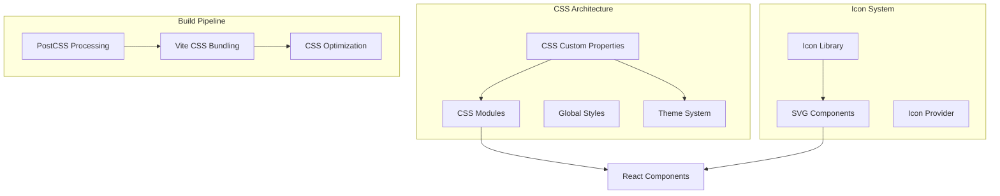

# Design Document

## Overview

The CSS migration will transform the browser-based IDE from a TailwindCSS-based styling system to a modern plain CSS architecture with professional icons. This migration will use CSS modules for component-scoped styling, CSS custom properties for theming, and a centralized SVG icon system similar to VSCode's approach. The design prioritizes maintainability, performance, and professional aesthetics.

## Architecture

### CSS Architecture Overview



### Technology Stack Changes

**Removed Dependencies:**
- TailwindCSS
- @tailwindcss/typography
- tailwindcss-animate

**New Dependencies:**
- CSS Modules (built into Vite)
- PostCSS with autoprefixer
- Lucide React (professional icon library)
- CSS custom properties for theming

## Components and Interfaces

### CSS Module Structure

#### 1. Global CSS Variables
```css
/* styles/variables.css */
:root {
  /* Colors - Light Theme */
  --color-primary: #007acc;
  --color-secondary: #6c757d;
  --color-success: #28a745;
  --color-danger: #dc3545;
  --color-warning: #ffc107;
  
  /* Background Colors */
  --bg-primary: #ffffff;
  --bg-secondary: #f8f9fa;
  --bg-tertiary: #e9ecef;
  --bg-accent: #f0f0f0;
  
  /* Text Colors */
  --text-primary: #212529;
  --text-secondary: #6c757d;
  --text-muted: #868e96;
  --text-inverse: #ffffff;
  
  /* Border Colors */
  --border-primary: #dee2e6;
  --border-secondary: #e9ecef;
  --border-focus: #007acc;
  
  /* Spacing */
  --spacing-xs: 0.25rem;
  --spacing-sm: 0.5rem;
  --spacing-md: 1rem;
  --spacing-lg: 1.5rem;
  --spacing-xl: 2rem;
  
  /* Typography */
  --font-family-mono: 'Fira Code', 'Monaco', 'Cascadia Code', monospace;
  --font-family-sans: -apple-system, BlinkMacSystemFont, 'Segoe UI', sans-serif;
  --font-size-xs: 0.75rem;
  --font-size-sm: 0.875rem;
  --font-size-base: 1rem;
  --font-size-lg: 1.125rem;
  
  /* Shadows */
  --shadow-sm: 0 1px 2px rgba(0, 0, 0, 0.05);
  --shadow-md: 0 4px 6px rgba(0, 0, 0, 0.1);
  --shadow-lg: 0 10px 15px rgba(0, 0, 0, 0.1);
  
  /* Transitions */
  --transition-fast: 0.15s ease;
  --transition-normal: 0.3s ease;
  --transition-slow: 0.5s ease;
}

/* Dark Theme */
[data-theme="dark"] {
  --bg-primary: #1e1e1e;
  --bg-secondary: #252526;
  --bg-tertiary: #2d2d30;
  --bg-accent: #383838;
  
  --text-primary: #cccccc;
  --text-secondary: #969696;
  --text-muted: #6a6a6a;
  
  --border-primary: #3e3e42;
  --border-secondary: #2d2d30;
}
```

#### 2. Component CSS Modules
```css
/* components/Editor/Editor.module.css */
.editor {
  display: flex;
  flex-direction: column;
  height: 100%;
  background-color: var(--bg-primary);
  border: 1px solid var(--border-primary);
  border-radius: 4px;
}

.editorHeader {
  display: flex;
  align-items: center;
  padding: var(--spacing-sm) var(--spacing-md);
  background-color: var(--bg-secondary);
  border-bottom: 1px solid var(--border-primary);
  min-height: 35px;
}

.tabContainer {
  display: flex;
  align-items: center;
  gap: var(--spacing-xs);
  flex: 1;
}

.tab {
  display: flex;
  align-items: center;
  gap: var(--spacing-xs);
  padding: var(--spacing-xs) var(--spacing-sm);
  background-color: transparent;
  border: none;
  border-radius: 4px;
  color: var(--text-secondary);
  font-size: var(--font-size-sm);
  cursor: pointer;
  transition: all var(--transition-fast);
}

.tab:hover {
  background-color: var(--bg-accent);
  color: var(--text-primary);
}

.tab.active {
  background-color: var(--bg-primary);
  color: var(--text-primary);
  border: 1px solid var(--border-primary);
}

.tabIcon {
  width: 16px;
  height: 16px;
  flex-shrink: 0;
}

.closeButton {
  display: flex;
  align-items: center;
  justify-content: center;
  width: 16px;
  height: 16px;
  border: none;
  background: none;
  border-radius: 2px;
  cursor: pointer;
  opacity: 0.7;
  transition: all var(--transition-fast);
}

.closeButton:hover {
  opacity: 1;
  background-color: var(--bg-accent);
}
```

### Icon System Design

#### 1. Icon Component Architecture
```javascript
// components/Icon/Icon.jsx
import { forwardRef } from 'react';
import * as LucideIcons from 'lucide-react';
import { fileTypeIcons } from './fileTypeIcons';
import styles from './Icon.module.css';

const Icon = forwardRef(({ 
  name, 
  size = 16, 
  className = '', 
  fileType,
  ...props 
}, ref) => {
  // Handle file type icons
  if (fileType) {
    const FileIcon = fileTypeIcons[fileType] || fileTypeIcons.default;
    return (
      <FileIcon 
        ref={ref}
        size={size}
        className={`${styles.icon} ${className}`}
        {...props}
      />
    );
  }
  
  // Handle Lucide icons
  const LucideIcon = LucideIcons[name];
  if (!LucideIcon) {
    console.warn(`Icon "${name}" not found`);
    return <LucideIcons.HelpCircle size={size} className={className} />;
  }
  
  return (
    <LucideIcon 
      ref={ref}
      size={size}
      className={`${styles.icon} ${className}`}
      {...props}
    />
  );
});

export default Icon;
```

#### 2. File Type Icon Mapping
```javascript
// components/Icon/fileTypeIcons.js
import {
  FileText,
  FileCode,
  FileImage,
  FileVideo,
  FileArchive,
  Folder,
  FolderOpen,
  Settings,
  Database,
  Globe,
  Palette,
  Terminal,
  Package,
  GitBranch,
  Lock,
  Key,
  FileJson,
  FileSpreadsheet,
  FilePdf,
  FileMusic,
  Code,
  Braces,
  Hash,
  Layers,
  Box,
  Coffee,
  Zap,
  Cpu,
  Smartphone,
  Monitor,
  Cloud,
  Server,
  HardDrive
} from 'lucide-react';

export const fileTypeIcons = {
  // Programming Languages
  'js': Code,
  'jsx': Code,
  'ts': Code,
  'tsx': Code,
  'py': Code,
  'java': Coffee,
  'cpp': Cpu,
  'c': Cpu,
  'cs': Hash,
  'php': Code,
  'rb': Code,
  'go': Box,
  'rs': Cpu,
  'swift': Smartphone,
  'kt': Smartphone,
  'dart': Code,
  'scala': Code,
  'clj': Code,
  'hs': Code,
  'ml': Code,
  'r': Code,
  'matlab': Code,
  
  // Web Technologies
  'html': Globe,
  'css': Palette,
  'scss': Palette,
  'sass': Palette,
  'less': Palette,
  'vue': Code,
  'svelte': Code,
  'astro': Code,
  
  // Configuration Files
  'json': FileJson,
  'yaml': Settings,
  'yml': Settings,
  'toml': Settings,
  'ini': Settings,
  'cfg': Settings,
  'conf': Settings,
  'config': Settings,
  'env': Settings,
  'dockerfile': Box,
  'docker-compose': Layers,
  
  // Package Files
  'package.json': Package,
  'package-lock.json': Lock,
  'yarn.lock': Lock,
  'composer.json': Package,
  'requirements.txt': FileText,
  'gemfile': Package,
  'cargo.toml': Package,
  'go.mod': Package,
  'pom.xml': Package,
  'build.gradle': Package,
  
  // Documentation
  'md': FileText,
  'mdx': FileText,
  'txt': FileText,
  'rtf': FileText,
  'doc': FileText,
  'docx': FileText,
  'pdf': FilePdf,
  'readme': FileText,
  'license': Key,
  'changelog': FileText,
  
  // Data Files
  'csv': FileSpreadsheet,
  'xlsx': FileSpreadsheet,
  'xls': FileSpreadsheet,
  'sql': Database,
  'db': Database,
  'sqlite': Database,
  'xml': FileCode,
  
  // Media Files
  'png': FileImage,
  'jpg': FileImage,
  'jpeg': FileImage,
  'gif': FileImage,
  'svg': FileImage,
  'webp': FileImage,
  'ico': FileImage,
  'mp4': FileVideo,
  'avi': FileVideo,
  'mov': FileVideo,
  'webm': FileVideo,
  'mp3': FileMusic,
  'wav': FileMusic,
  'flac': FileMusic,
  
  // Archive Files
  'zip': FileArchive,
  'rar': FileArchive,
  'tar': FileArchive,
  'gz': FileArchive,
  '7z': FileArchive,
  
  // Special Files
  'gitignore': GitBranch,
  'gitattributes': GitBranch,
  'editorconfig': Settings,
  'eslintrc': Settings,
  'prettierrc': Settings,
  'babelrc': Settings,
  'webpack': Settings,
  'vite': Zap,
  'rollup': Settings,
  'tsconfig': Settings,
  'jsconfig': Settings,
  
  // Folders
  'folder': Folder,
  'folder-open': FolderOpen,
  'node_modules': Package,
  'dist': Box,
  'build': Box,
  'public': Globe,
  'src': Code,
  'assets': FileImage,
  'components': Layers,
  'pages': Globe,
  'api': Server,
  'utils': Settings,
  'lib': Package,
  'tests': Terminal,
  'docs': FileText,
  
  // Default
  'default': FileText
};

// Helper function to get icon by file extension
export const getFileTypeIcon = (filename) => {
  if (!filename) return fileTypeIcons.default;
  
  const extension = filename.split('.').pop()?.toLowerCase();
  const baseName = filename.toLowerCase();
  
  // Check for specific filenames first
  if (fileTypeIcons[baseName]) {
    return fileTypeIcons[baseName];
  }
  
  // Check for extensions
  if (extension && fileTypeIcons[extension]) {
    return fileTypeIcons[extension];
  }
  
  return fileTypeIcons.default;
};
```

#### 3. Icon Provider Component
```javascript
// components/Icon/IconProvider.jsx
import { createContext, useContext } from 'react';

const IconContext = createContext({
  size: 16,
  strokeWidth: 2,
  color: 'currentColor'
});

export const IconProvider = ({ children, defaultSize = 16, ...props }) => {
  return (
    <IconContext.Provider value={{ size: defaultSize, ...props }}>
      {children}
    </IconContext.Provider>
  );
};

export const useIconContext = () => useContext(IconContext);
```

### Layout System Migration

#### 1. Grid and Flexbox Utilities
```css
/* styles/layout.css */
.flex {
  display: flex;
}

.flex-col {
  flex-direction: column;
}

.flex-row {
  flex-direction: row;
}

.items-center {
  align-items: center;
}

.items-start {
  align-items: flex-start;
}

.items-end {
  align-items: flex-end;
}

.justify-center {
  justify-content: center;
}

.justify-between {
  justify-content: space-between;
}

.justify-start {
  justify-content: flex-start;
}

.justify-end {
  justify-content: flex-end;
}

.flex-1 {
  flex: 1;
}

.flex-none {
  flex: none;
}

.grid {
  display: grid;
}

.grid-cols-1 {
  grid-template-columns: repeat(1, 1fr);
}

.grid-cols-2 {
  grid-template-columns: repeat(2, 1fr);
}

.grid-cols-3 {
  grid-template-columns: repeat(3, 1fr);
}

.gap-1 {
  gap: var(--spacing-xs);
}

.gap-2 {
  gap: var(--spacing-sm);
}

.gap-4 {
  gap: var(--spacing-md);
}

.gap-6 {
  gap: var(--spacing-lg);
}
```

#### 2. Responsive Design System
```css
/* styles/responsive.css */
/* Mobile First Approach */
.container {
  width: 100%;
  padding-left: var(--spacing-md);
  padding-right: var(--spacing-md);
}

/* Tablet */
@media (min-width: 768px) {
  .container {
    max-width: 768px;
    margin-left: auto;
    margin-right: auto;
  }
  
  .md\:flex-row {
    flex-direction: row;
  }
  
  .md\:grid-cols-2 {
    grid-template-columns: repeat(2, 1fr);
  }
}

/* Desktop */
@media (min-width: 1024px) {
  .container {
    max-width: 1024px;
  }
  
  .lg\:grid-cols-3 {
    grid-template-columns: repeat(3, 1fr);
  }
  
  .lg\:flex-row {
    flex-direction: row;
  }
}

/* Large Desktop */
@media (min-width: 1280px) {
  .container {
    max-width: 1280px;
  }
}
```

## Data Models

### Theme Configuration
```javascript
// types/theme.js
export const ThemeConfig = {
  name: String, // 'light' | 'dark' | 'high-contrast'
  colors: {
    primary: String,
    secondary: String,
    success: String,
    danger: String,
    warning: String,
    info: String,
    background: {
      primary: String,
      secondary: String,
      tertiary: String,
      accent: String
    },
    text: {
      primary: String,
      secondary: String,
      muted: String,
      inverse: String
    },
    border: {
      primary: String,
      secondary: String,
      focus: String
    }
  },
  typography: {
    fontFamily: {
      sans: String,
      mono: String
    },
    fontSize: {
      xs: String,
      sm: String,
      base: String,
      lg: String,
      xl: String
    }
  },
  spacing: {
    xs: String,
    sm: String,
    md: String,
    lg: String,
    xl: String
  },
  shadows: {
    sm: String,
    md: String,
    lg: String
  }
};
```

### Icon Configuration
```javascript
// types/icon.js
export const IconConfig = {
  name: String,
  size: Number, // 12, 16, 20, 24, 32
  strokeWidth: Number, // 1, 1.5, 2, 2.5
  color: String,
  className: String,
  fileType: String, // For file type icons
  variant: String // 'outline' | 'filled' | 'duotone'
};

export const FileTypeMapping = {
  extension: String,
  iconName: String,
  color: String // Optional color override
};
```

## Error Handling

### CSS Loading Errors
```javascript
// utils/cssErrorHandler.js
export const handleCSSLoadError = (error, componentName) => {
  console.error(`Failed to load CSS for ${componentName}:`, error);
  
  // Fallback to inline styles or default classes
  return {
    fallbackClassName: 'css-load-error',
    shouldUseInlineStyles: true
  };
};

// Fallback CSS for critical components
export const fallbackStyles = {
  button: {
    padding: '8px 16px',
    border: '1px solid #ccc',
    borderRadius: '4px',
    backgroundColor: '#f8f9fa',
    cursor: 'pointer'
  },
  input: {
    padding: '8px 12px',
    border: '1px solid #ccc',
    borderRadius: '4px',
    fontSize: '14px'
  }
};
```

### Icon Loading Errors
```javascript
// components/Icon/IconErrorBoundary.jsx
import { Component } from 'react';
import { HelpCircle } from 'lucide-react';

class IconErrorBoundary extends Component {
  constructor(props) {
    super(props);
    this.state = { hasError: false };
  }

  static getDerivedStateFromError(error) {
    return { hasError: true };
  }

  componentDidCatch(error, errorInfo) {
    console.error('Icon loading error:', error, errorInfo);
  }

  render() {
    if (this.state.hasError) {
      return (
        <HelpCircle 
          size={this.props.size || 16} 
          className={this.props.className}
        />
      );
    }

    return this.props.children;
  }
}

export default IconErrorBoundary;
```

## Testing Strategy

### CSS Testing
```javascript
// tests/css/cssModules.test.js
import { render } from '@testing-library/react';
import Button from '../components/Button/Button';
import styles from '../components/Button/Button.module.css';

describe('CSS Modules', () => {
  test('applies correct CSS classes', () => {
    const { container } = render(<Button>Test</Button>);
    const button = container.firstChild;
    
    expect(button).toHaveClass(styles.button);
    expect(button).toHaveStyle({
      padding: expect.any(String),
      borderRadius: expect.any(String)
    });
  });
  
  test('supports theme variations', () => {
    const { container } = render(<Button variant="primary">Test</Button>);
    const button = container.firstChild;
    
    expect(button).toHaveClass(styles.primary);
  });
});
```

### Icon Testing
```javascript
// tests/components/Icon.test.js
import { render } from '@testing-library/react';
import Icon from '../components/Icon/Icon';

describe('Icon Component', () => {
  test('renders Lucide icon correctly', () => {
    const { container } = render(<Icon name="Home" size={24} />);
    const icon = container.querySelector('svg');
    
    expect(icon).toBeInTheDocument();
    expect(icon).toHaveAttribute('width', '24');
    expect(icon).toHaveAttribute('height', '24');
  });
  
  test('renders file type icon correctly', () => {
    const { container } = render(<Icon fileType="js" />);
    const icon = container.querySelector('svg');
    
    expect(icon).toBeInTheDocument();
  });
  
  test('handles missing icons gracefully', () => {
    const { container } = render(<Icon name="NonExistentIcon" />);
    const icon = container.querySelector('svg');
    
    expect(icon).toBeInTheDocument(); // Should render fallback
  });
});
```

### Visual Regression Testing
```javascript
// tests/visual/components.test.js
import { chromium } from 'playwright';

describe('Visual Regression Tests', () => {
  let browser, page;
  
  beforeAll(async () => {
    browser = await chromium.launch();
    page = await browser.newPage();
  });
  
  afterAll(async () => {
    await browser.close();
  });
  
  test('button component matches design', async () => {
    await page.goto('/storybook/button');
    await page.screenshot({ path: 'tests/screenshots/button.png' });
    
    // Compare with baseline screenshot
    expect(await page.screenshot()).toMatchSnapshot('button.png');
  });
  
  test('dark theme renders correctly', async () => {
    await page.goto('/storybook/button');
    await page.click('[data-theme-toggle]');
    
    expect(await page.screenshot()).toMatchSnapshot('button-dark.png');
  });
});
```

## Performance Optimization

### CSS Bundle Optimization
```javascript
// vite.config.js CSS optimization
export default {
  css: {
    modules: {
      localsConvention: 'camelCase',
      generateScopedName: '[name]__[local]___[hash:base64:5]'
    },
    postcss: {
      plugins: [
        autoprefixer(),
        cssnano({
          preset: 'default'
        })
      ]
    }
  },
  build: {
    cssCodeSplit: true,
    rollupOptions: {
      output: {
        assetFileNames: (assetInfo) => {
          if (assetInfo.name.endsWith('.css')) {
            return 'css/[name].[hash].css';
          }
          return 'assets/[name].[hash][extname]';
        }
      }
    }
  }
};
```

### Icon Optimization
```javascript
// utils/iconOptimization.js
import { lazy, Suspense } from 'react';

// Lazy load icon sets for better performance
const LazyIconSet = lazy(() => import('./IconSet'));

export const OptimizedIcon = ({ name, ...props }) => {
  return (
    <Suspense fallback={<div className="icon-placeholder" />}>
      <LazyIconSet name={name} {...props} />
    </Suspense>
  );
};

// Icon caching for frequently used icons
const iconCache = new Map();

export const getCachedIcon = (name, props) => {
  const cacheKey = `${name}-${JSON.stringify(props)}`;
  
  if (iconCache.has(cacheKey)) {
    return iconCache.get(cacheKey);
  }
  
  const icon = <Icon name={name} {...props} />;
  iconCache.set(cacheKey, icon);
  
  return icon;
};
```

## Migration Strategy

### Phase 1: Setup and Infrastructure
1. Remove TailwindCSS dependencies
2. Setup CSS modules configuration
3. Create CSS variable system
4. Install and configure icon library

### Phase 2: Core Component Migration
1. Migrate layout components (Header, Sidebar, Main)
2. Migrate form components (Button, Input, Select)
3. Migrate navigation components (Tabs, Menu)
4. Update theme system

### Phase 3: Feature Component Migration
1. Migrate editor components
2. Migrate file explorer components
3. Migrate terminal components
4. Update all icon usage

### Phase 4: Testing and Optimization
1. Run visual regression tests
2. Performance testing and optimization
3. Cross-browser compatibility testing
4. Accessibility testing

### Phase 5: Documentation and Cleanup
1. Update component documentation
2. Create style guide
3. Remove unused CSS
4. Final performance audit